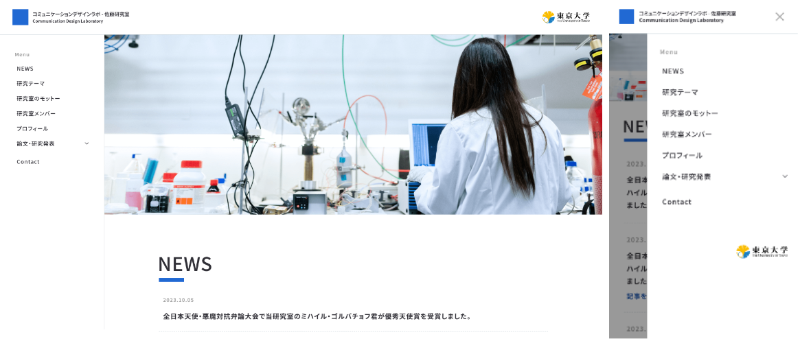
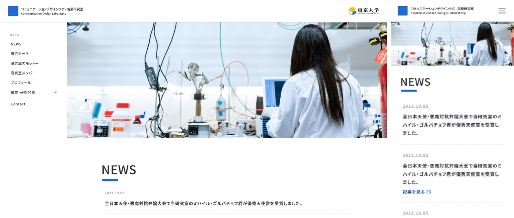
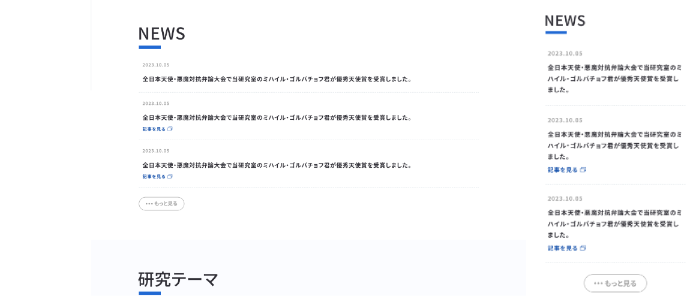
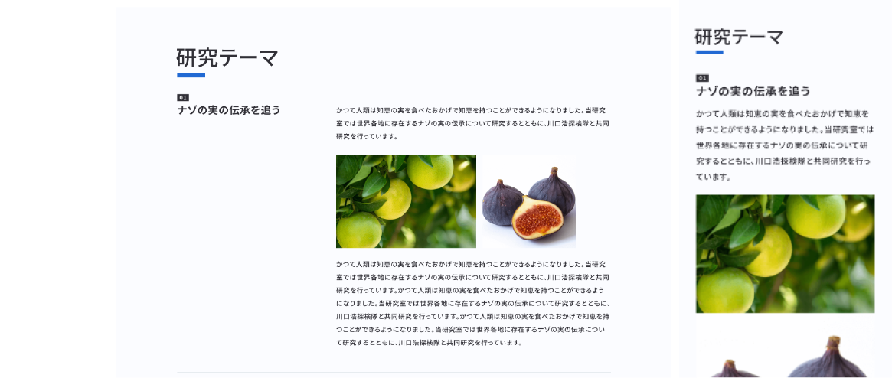
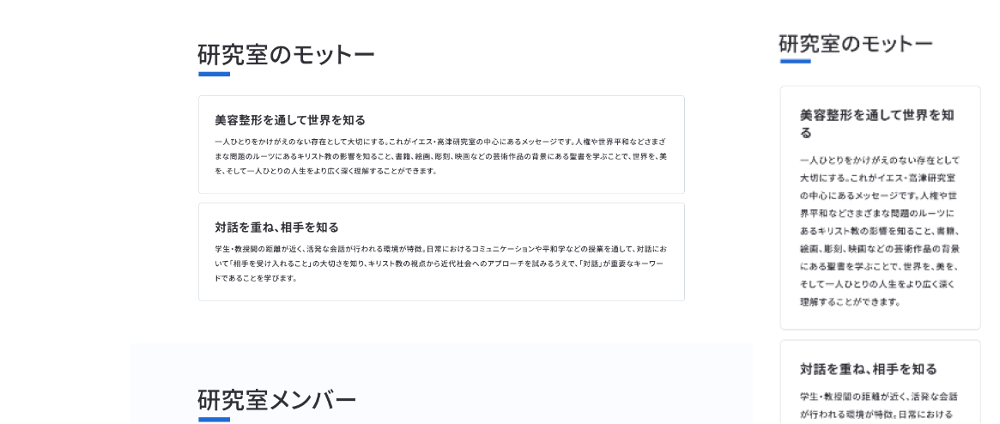
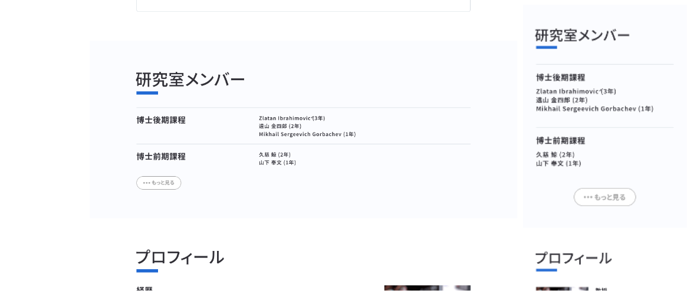
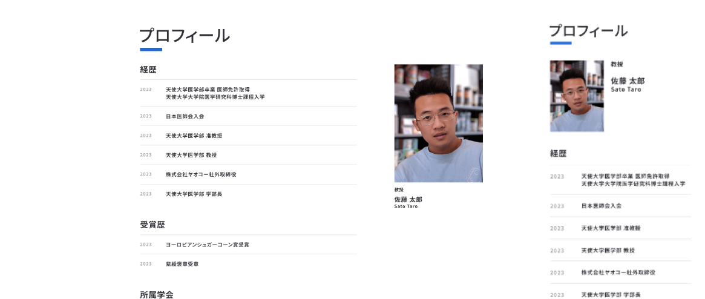
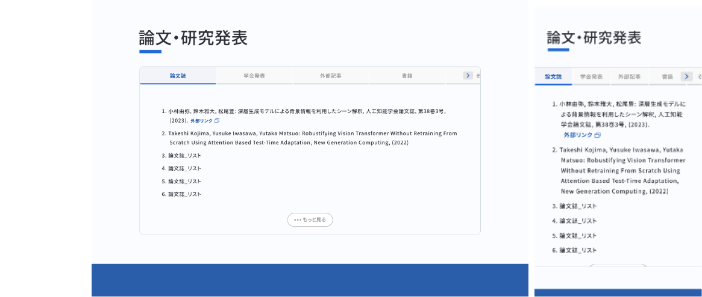
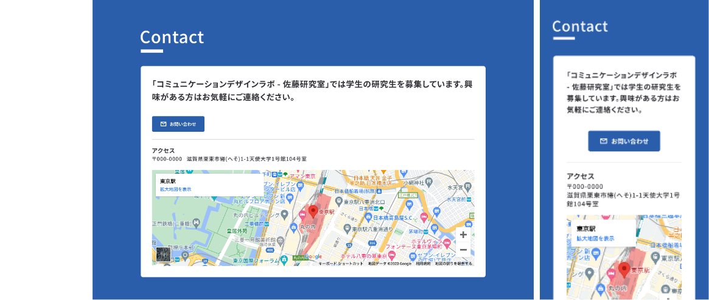

# 研究者テンプレページの仕様書

- [研究者テンプレページの仕様書](#研究者テンプレページの仕様書)
  - [ヘッダーについて](#ヘッダーについて)
    - [上部ヘッダーについて](#上部ヘッダーについて)
    - [グローバルメニューについて](#グローバルメニューについて)
      - [大学ロゴについて](#大学ロゴについて)
  - [メインコンテンツ](#メインコンテンツ)
    - [ヘッダー画像について](#ヘッダー画像について)
    - [セクションについて](#セクションについて)
    - [NEWS セクションについて](#news-セクションについて)
    - [研究テーマセクションについて](#研究テーマセクションについて)
    - [研究室のモットーセクションについて](#研究室のモットーセクションについて)
    - [研究室メンバーセクションについて](#研究室メンバーセクションについて)
    - [プロフィールセクションについて](#プロフィールセクションについて)
    - [論文研究発表セクションについて](#論文研究発表セクションについて)
    - [Contact セクションについて](#contact-セクションについて)
  - [その他](#その他)
    - [meta 情報について](#meta-情報について)

## ヘッダーについて



### 上部ヘッダーについて

画面上部のヘッダー部分になります。下記該当コードの `header-box` `header-name-wrapp-ja` `header-name-wrapp-en` の内容を適宜編集してください。

```html
<div class="header-contents">
  <a href="#" class="header-title">
    <div class="header-box">
      アイコン的な画像を挿入する場合はここにimgタグを入力してください
    </div>
    <div class="header-name">
      <h1 class="header-name-wrapp">
        <span class="header-name-wrapp-ja">
          この箇所に研究室名や個人名を入力してください
        </span>
        <span class="header-name-wrapp-en">
          この箇所に研究室名や個人名の英訳を入力してください
        </span>
      </h1>
    </div>
  </a>
  <button id="burger" class="is-sp" type="button">
    <span class="header-burger"></span>
    <span class="header-burger"></span>
    <span class="header-burger"></span>
  </button>
</div>
```

### グローバルメニューについて

グローバルメニューはメインコンテンツのセクションに付随する data 属性から Javascritp 側で動的に生成しています。ですので、`id="nav-list"` の部分は編集しないでください。

#### 大学ロゴについて

所属する大学や組織のロゴマークがある場合、`logo-university` の a タグ内に img を挿入してください。

```html
<!-- START グローバルナビ -->
<nav id="g-nav">
  <div class="nav-inner">
    <p>Menu</p>
    <div id="nav-list"></div>
    <div class="logo-university">
      <a href="#" target="_blank">
        ここに所属する大学のロゴ画像をimgタグで入力してください。
      </a>
    </div>
  </div>
  <span class="overlay"></span>
</nav>
<!-- END グローバルナビ -->
```

## メインコンテンツ

### ヘッダー画像について


画像を 3 種類用意していただく必要があります。

- PC 用\_2 種
  - ① retina では無いディスプレイ用のために画像パスのあとに `1x` とつける
  - ② retina ディスプレイ用のために画像パスのあとに `2x` とつける
  - ③ PC 画像は`(min-width:769px)` の `srcset` 内にパスを記述してください。
- SP 用\_1 種
  - ④ SP 画像は`(max-width:768px)` の `srcset` 内にパスを記述してください。
- img タグの画像はフォールバック用の記述になりますので、中間である ① の画像を記述してください。

```html
<!-- START メインビジュアル -->
<div class="mv">
  <picture class="mv">
    <!-- PC用 -->
    <source
      media="(min-width:769px)"
      srcset="
        ./assets/images/sample-mv.png     1x,
        ./assets/images/sample-mv-@x2.png 2x
      "
    />
    <!-- SP用 -->
    <source media="(max-width:768px)" srcset="./assets/images/sample-mv.png" />
    
  </picture>
</div>
<!-- END メインビジュアル -->
```

### セクションについて

各コンテンツセクションは `data-title=""` と `id=""` の中を項目に応じて編集してください。<br>

- `data-title` はグローバルメニューの項目名
- `id` はアンカーリンク<br>

になります。

```html
<section
  data-accordion="normal"
  data-class="nav-default"
  data-title="NEWS"
  id="news"
  class="scroll-point"
></section>
```

論文セクションの場合は`data-accordion` の中身が"normal"ではなく、"nav-drop"になっていることを確認してください。

```html
<section
  data-accordion="nav-drop"
  data-class="nav-default"
  data-title="論文・研究発表"
  id="academic"
  class="scroll-point"
></section>
```

### NEWS セクションについて



ニュースの一覧は下記 li タグを複製して日付、タイトル、外部リンクがある場合は URL を入力してください。<br>
外部リンクが無い場合は`is-link` クラスを削除してください。

```html
<li class="news-item is-link" data-more="">
  <div class="news-date">2023.10.05</div>
  <div class="news-text">
    <div class="news-title">
      全日本天使・悪魔対抗弁論大会で当研究室のミハイル・ゴルバチョフ君が優秀天使賞を受賞しました。
    </div>
    <a href="#" target="_blank" class="link"
      >記事を見る<span class="ico"
        ><svg viewBox="0 0 14 12">
          <use
            xlink:href="./assets/images/ico/splite.svg#ico-link"
          ></use></svg></span
    ></a>
  </div>
</li>
```

### 研究テーマセクションについて



見出し、内容、画像があれば画像を入力してください。
リストのナンバリングは css 側で自動的に付与されます。

```html
<li class="theme-item">
  <h3 class="h3-number">ナゾの実の伝承を追う</h3>
  <div class="theme-body">
    <p>
      かつて人類は知恵の実を食べたおかげで知恵を持つことができるようになりました。当研究室では世界各地に存在するナゾの実の伝承について研究するとともに、川口浩探検隊と共同研究を行っています。
    </p>
    <div class="theme-img">
      <picture>
        <!-- PC用でretinaかそうじゃないか -->
        <source
          media="(min-width:769px)"
          srcset="
            ./assets/images/sample-ph-01.png     1x,
            ./assets/images/sample-ph-01-@x2.png 2x
          "
        />
        <!-- SP用 -->
        <source
          media="(max-width:768px)"
          srcset="./assets/images/sample-ph-01.png"
        />
        
      </picture>
      <picture>
        <!-- PC用でretinaかそうじゃないか -->
        <source
          media="(min-width:769px)"
          srcset="
            ./assets/images/sample-ph-02.png     1x,
            ./assets/images/sample-ph-02-@x2.png 2x
          " />
        <!-- SP用 -->
        <source
          media="(max-width:768px)"
          srcset="./assets/images/sample-ph-02.png" />
        </picture>
    </div>
    <p>
      かつて人類は知恵の実を食べたおかげで知恵を持つことができるようになりました。当研究室では世界各地に存在するナゾの実の伝承について研究するとともに、川口浩探検隊と共同研究を行っています。かつて人類は知恵の実を食べたおかげで知恵を持つことができるようになりました。当研究室では世界各地に存在するナゾの実の伝承について研究するとともに、川口浩探検隊と共同研究を行っています。かつて人類は知恵の実を食べたおかげで知恵を持つことができるようになりました。当研究室では世界各地に存在するナゾの実の伝承について研究するとともに、川口浩探検隊と共同研究を行っています。
    </p>
  </div>
</li>
```

### 研究室のモットーセクションについて



見出し本文を入力してください。

```html
<li>
  <h3>美容整形を通して世界を知る</h3>
  <p>
    一人ひとりをかけがえのない存在として大切にする。これがイエス・高津研究室の中心にあるメッセージです。人権や世界平和などさまざまな問題のルーツにあるキリスト教の影響を知ること、書籍、絵画、彫刻、映画などの芸術作品の背景にある聖書を学ぶことで、世界を、美を、そして一人ひとりの人生をより広く深く理解することができます。
  </p>
</li>
```

### 研究室メンバーセクションについて



h4 に大項目、p にメンバーの名前を入力してください。<br>
リストの 2 番目以降は非表示になり、もっと見るボタンで表示する形式になります。

```html
<li class="member-li-wrapp" data-more="">
  <h4>博士後期課程</h4>
  <ul class="member-li">
    <li class="member-name-li">
      <div class="member-name">
        <p>Zlatan Ibrahimović (3年)</p>
        <p>遠山 金四郎 (2年)</p>
        <p>Mikhail Sergeevich Gorbachev (1年)</p>
      </div>
    </li>
  </ul>
</li>
```

### プロフィールセクションについて



画像、外部リンクがあれば URL、略歴を入力してください。

```html
<!-- 氏名・役職・画像欄 -->
<div>
  <div class="profile-info-text-wrapp">
    <p class="profile-info-position">教授</p>
    <div class="profile-info-name">
      <p class="profile-info-name-ja">佐藤 太郎</p>
      <p>Sato Taro</p>
    </div>
  </div>
  <div class="profile-info-link-wrapp is-link">
    <a href="#" target="_blank" class="link"
      >東京大学研究者紹介<span class="ico"
        ><svg viewBox="0 0 14 12">
          <use
            xlink:href="./assets/images/ico/splite.svg#ico-link"
          ></use></svg></span
    ></a>
    <a href="#" target="_blank" class="link"
      >Google Scholar<span class="ico"
        ><svg viewBox="0 0 14 12">
          <use
            xlink:href="./assets/images/ico/splite.svg#ico-link"
          ></use></svg></span
    ></a>
  </div>
</div>

<!-- 略歴 -->
<ul class="profile-history-wrapp">
  <li>
    <h4>経歴</h4>
    <ul class="profile-history-li">
      <li class="profile-history-text-wrapp">
        <p class="profile-history-year">2023</p>
        <div class="profile-history-text">
          <p>天使大学医学部卒業 医師免許取得</p>
          <p>天使大学大学院医学研究科博士課程入学</p>
        </div>
      </li>
    </ul>
  </li>
  <li>
    <h4>受賞歴</h4>
    <ul class="profile-history-li">
      <li class="profile-history-text-wrapp">
        <p class="profile-history-year">2023</p>
        <div class="profile-history-text">
          <p>ヨーロピアンシュガーコーン賞受賞</p>
        </div>
      </li>
    </ul>
  </li>
  <li>
    <h4>所属学会</h4>
    <ul class="profile-history-li">
      <li class="profile-history-text-wrapp">
        <div class="profile-history-text">
          <p>日本医学会</p>
          <p>国際形成外科学会</p>
          <p>国際形成外科学会</p>
        </div>
      </li>
    </ul>
  </li>
</ul>
```

### 論文研究発表セクションについて



タブの編集は下記箇所を編集してください。`data-index=`はグローバルナビのアコーディオンに出現する部分になりますので、忘れずにこちらも入力してください。

```html
<div class="swiper-wrapper tab-wrapp">
  <div class="swiper-slide" data-index="論文誌">論文誌</div>
  <div class="swiper-slide" data-index="学会発表">学会発表</div>
  <div class="swiper-slide" data-index="外部記事">外部記事</div>
  <div class="swiper-slide" data-index="書籍">書籍</div>
  <div class="swiper-slide" data-index="その他">その他</div>
</div>
```

タブの中身は下記の`swiper-slide` を複製して適宜編集してください。

```html
<div class="swiper mySwiper2">
  <div class="swiper-wrapper">
    <div class="swiper-slide" data-simplebar="">
      <ul class="paper">
        <li class="list-item is-link">
          小林由弥, 鈴木雅大, 松尾豊:
          深層生成モデルによる背景情報を利用したシーン解釈, 人工知能学会論文誌,
          第38巻3号, (2023).
          <span>
            <a class="link" href="#" target="_blank">
              外部リンク
              <span class="ico">
                <svg viewBox="0 0 14 12">
                  <use
                    xlink:href="./assets/images/ico/splite.svg#ico-link"
                  ></use>
                </svg>
              </span>
            </a>
          </span>
        </li>
      </ul>
      <button class="load-more">
        <svg viewBox="0 0 13 3">
          <use xlink:href="./assets/images/ico/splite.svg#ico-more"></use></svg
        >もっと見る
      </button>
    </div>
    <div class="swiper-slide" data-simplebar="">
      <!-- ul から同様の中身 -->
    </div>
    <div class="swiper-slide" data-simplebar="">
      <!-- ul から同様の中身 -->
    </div>
  </div>
</div>
```

### Contact セクションについて



問い合わせのメールアドレスは`value=`の中にアドレスを入力してください。

```html
<!-- メールアドレス -->
<input id="tagText" type="text" value="sample@test.co.jp" hidden readonly />
```

GoogleMaps の下記 iframe ごと変更してください。

```html
<iframe
  class="googlemap"
  src="https://www.google.com/maps/embed?pb=!1m18!1m12!1m3!1d3240.828030689842!2d139.7645498754798!3d35.681236172587326!2m3!1f0!2f0!3f0!3m2!1i1024!2i768!4f13.1!3m3!1m2!1s0x60188bfbd89f700b%3A0x277c49ba34ed38!2z5p2x5Lqs6aeF!5e0!3m2!1sja!2sjp!4v1698374467641!5m2!1sja!2sjp"
  style="border: 0"
  allowfullscreen=""
  loading="lazy"
  referrerpolicy="no-referrer-when-downgrade"
>
</iframe>
```

## その他

### meta 情報について

head 内を適宜変更してください。

```html
<title>研究者WEBサイトテンプレート</title>
<meta name="description" content="研究者WEBサイトテンプレート" />
<link rel="icon" href="./assets/images/common/favicon.ico" sizes="any" />
<!-- 32×32 -->
<link rel="icon" href="./assets/images/common/icon.svg" type="image/svg+xml" />
<link
  rel="apple-touch-icon"
  href="./assets/images/common/apple-touch-icon.png"
/>
<!-- 180×180 -->
<!-- og -->
<meta property="og:url" content="" />
<meta property="og:type" content="website" />
<meta property="og:title" content="研究者WEBサイトテンプレート" />
<meta property="og:image" content="./assets/images/common/ogp.jpg" />
<meta property="og:description" content="研究者WEBサイトテンプレート" />
<meta property="og:site_name" content="研究者WEBサイトテンプレート" />
<meta property="og:locale" content="ja_JP" />
<!-- x -->
<meta name="twitter:card" content="summary_large_image" />
<meta name="twitter:url" content="" />
<meta name="twitter:title" content="研究者WEBサイトテンプレート" />
<meta name="twitter:description" content="研究者WEBサイトテンプレート" />
<meta name="twitter:image" content="./assets/images/common/ogp.jpg" />
<meta name="twitter:image:alt" content="研究者WEBサイトテンプレート" />
<meta name="twitter:dnt" content="on" />
```
