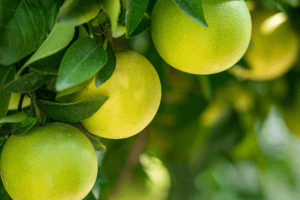
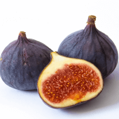

# 研究者テンプレページの仕様書

- [研究者テンプレページの仕様書](#研究者テンプレページの仕様書)
  - [ヘッダーについて](#ヘッダーについて)
    - [上部ヘッダーについて](#上部ヘッダーについて)
    - [グローバルメニューについて](#グローバルメニューについて)
      - [大学ロゴについて](#大学ロゴについて)
  - [メインコンテンツ](#メインコンテンツ)
    - [ヘッダー画像について](#ヘッダー画像について)
    - [セクションについて](#セクションについて)
    - [NEWS セクションについて](#news-セクションについて)
    - [研究テーマセクションについて](#研究テーマセクションについて)
    - [研究室のモットーセクションについて](#研究室のモットーセクションについて)
    - [研究室メンバーセクションについて](#研究室メンバーセクションについて)
    - [プロフィールセクションについて](#プロフィールセクションについて)
    - [論文研究発表セクションについて](#論文研究発表セクションについて)
    - [Contact セクションについて](#contact-セクションについて)
  - [その他](#その他)
    - [meta 情報について](#meta-情報について)

## ヘッダーについて

### 上部ヘッダーについて

画面上部のヘッダー部分になります。下記該当コードの `header-box` `header-name-wrapp-ja` `header-name-wrapp-en` の内容を適宜編集してください。

```html
<div class="header-contents">
  <a href="#top" class="header-title">
    <div class="header-box">
      アイコン的な画像を挿入する場合はここにimgタグを入力してください
    </div>
    <div class="header-name">
      <h1 class="header-name-wrapp">
        <span class="header-name-wrapp-ja">
          この箇所に研究室名や個人名を入力してください
        </span>
        <span class="header-name-wrapp-en">
          この箇所に研究室名や個人名の英訳を入力してください
        </span>
      </h1>
    </div>
  </a>
  <button id="burger" class="is-sp" type="button">
    <span class="header-burger"></span>
    <span class="header-burger"></span>
    <span class="header-burger"></span>
  </button>
</div>
```

### グローバルメニューについて

グローバルメニューはメインコンテンツのセクションに付随する data 属性から Javascritp 側で動的に生成しています。ですので、`id="nav-list"` の部分は編集しないでください。

#### 大学ロゴについて

所属する大学や組織のロゴマークがある場合、`logo-university` の a タグ内に img を挿入してください。

```html
<!-- START グローバルナビ -->
<nav id="g-nav">
  <div class="nav-inner">
    <p>Menu</p>
    <div id="nav-list"></div>
    <div class="logo-university">
      <a href="https://example.com" target="_blank" rel="noopener noreferrer">
        ここに所属する大学のロゴ画像をimgタグで入力してください。
      </a>
    </div>
  </div>
  <span class="overlay"></span>
</nav>
<!-- END グローバルナビ -->
```

## メインコンテンツ

### ヘッダー画像について

掲載権限を確認した画像を用意し、`src` と `alt` を編集してください。
画面幅ごとに画像を変更する場合は、必要に応じて `source` 要素を追加してください。

```html
<!-- START メインビジュアル -->
<div class="mv">
  <picture class="mv">
    
  </picture>
</div>
<!-- END メインビジュアル -->
```

### セクションについて

各コンテンツセクションは `data-title=""` と `id=""` の中を項目に応じて編集してください。<br>

- `data-title` はグローバルメニューの項目名
- `id` はアンカーリンク<br>

になります。

```html
<section
  data-accordion="normal"
  data-class="nav-default"
  data-title="NEWS"
  id="news"
  class="scroll-point"
></section>
```

論文セクションの場合は`data-accordion` の中身が"normal"ではなく、"nav-drop"になっていることを確認してください。

```html
<section
  data-accordion="nav-drop"
  data-class="nav-default"
  data-title="論文・研究発表"
  id="academic"
  class="scroll-point"
></section>
```

### NEWS セクションについて

ニュースの一覧は下記 li タグを複製して日付、タイトル、外部リンクがある場合は URL を入力してください。<br>
外部リンクが無い場合は`is-link` クラスを削除してください。

```html
<li class="news-item is-link" data-more="">
  <div class="news-date">20XX.04.01</div>
  <div class="news-text">
    <div class="news-title">
      ［学年］の［メンバー名］が［発表会名］で研究成果を発表しました。（サンプル）
    </div>
    <a
      href="https://example.com"
      target="_blank"
      rel="noopener noreferrer"
      class="link"
      >記事を見る<span class="ico"
        ><svg viewBox="0 0 14 12">
          <use
            xlink:href="./assets/images/ico/splite.svg#ico-link"
          ></use></svg></span
    ></a>
  </div>
</li>
```

### 研究テーマセクションについて

見出し、内容、画像があれば画像を入力してください。
リストのナンバリングは css 側で自動的に付与されます。

```html
<li class="theme-item">
  <h3 class="h3-number">研究テーマ名（サンプル）</h3>
  <div class="theme-body">
    <p>
      ここには研究の背景、目的、独自性を入力します。この文章は表示確認用のサンプルです。
    </p>
    <div class="theme-img">
      <picture>
        
      </picture>
      <picture>
        </picture>
    </div>
    <p>
      ここには研究方法、期待される成果、社会への応用可能性などを入力します。（サンプル）
    </p>
  </div>
</li>
```

### 研究室のモットーセクションについて

見出し本文を入力してください。

```html
<li>
  <h3>美容整形を通して世界を知る</h3>
  <p>
    一人ひとりをかけがえのない存在として大切にする。これがイエス・高津研究室の中心にあるメッセージです。人権や世界平和などさまざまな問題のルーツにあるキリスト教の影響を知ること、書籍、絵画、彫刻、映画などの芸術作品の背景にある聖書を学ぶことで、世界を、美を、そして一人ひとりの人生をより広く深く理解することができます。
  </p>
</li>
```

### 研究室メンバーセクションについて

h4 に大項目、p にメンバーの名前を入力してください。<br>
リストの 2 番目以降は非表示になり、もっと見るボタンで表示する形式になります。

```html
<li class="member-li-wrapp" data-more="">
  <h4>博士後期課程</h4>
  <ul class="member-li">
    <li class="member-name-li">
      <div class="member-name">
        <p>［博士後期課程3年 氏名］</p>
        <p>［博士後期課程2年 氏名］</p>
        <p>［博士後期課程1年 氏名］</p>
      </div>
    </li>
  </ul>
</li>
```

### プロフィールセクションについて

画像、外部リンクがあれば URL、略歴を入力してください。

```html
<!-- 氏名・役職・画像欄 -->
<div>
  <div class="profile-info-text-wrapp">
    <p class="profile-info-position">役職（サンプル）</p>
    <div class="profile-info-name">
      <p class="profile-info-name-ja">研究者名（サンプル）</p>
      <p>Researcher Name (Sample)</p>
    </div>
  </div>
  <div class="profile-info-link-wrapp is-link">
    <a
      href="https://example.com"
      target="_blank"
      rel="noopener noreferrer"
      class="link"
      >研究者紹介ページ<span class="ico"
        ><svg viewBox="0 0 14 12">
          <use
            xlink:href="./assets/images/ico/splite.svg#ico-link"
          ></use></svg></span
    ></a>
    <a
      href="https://example.com"
      target="_blank"
      rel="noopener noreferrer"
      class="link"
      >研究業績ページ<span class="ico"
        ><svg viewBox="0 0 14 12">
          <use
            xlink:href="./assets/images/ico/splite.svg#ico-link"
          ></use></svg></span
    ></a>
  </div>
</div>

<!-- 略歴 -->
<ul class="profile-history-wrapp">
  <li>
    <h4>経歴</h4>
    <ul class="profile-history-li">
      <li class="profile-history-text-wrapp">
        <p class="profile-history-year">20XX</p>
        <div class="profile-history-text">
          <p>［学歴・経歴を入力してください］（サンプル）</p>
        </div>
      </li>
    </ul>
  </li>
  <li>
    <h4>受賞歴</h4>
    <ul class="profile-history-li">
      <li class="profile-history-text-wrapp">
        <p class="profile-history-year">20XX</p>
        <div class="profile-history-text">
          <p>［受賞歴を入力してください］（サンプル）</p>
        </div>
      </li>
    </ul>
  </li>
  <li>
    <h4>所属学会</h4>
    <ul class="profile-history-li">
      <li class="profile-history-text-wrapp">
        <div class="profile-history-text">
          <p>［所属学会を入力してください］（サンプル）</p>
        </div>
      </li>
    </ul>
  </li>
</ul>
```

### 論文研究発表セクションについて

タブの編集は下記箇所を編集してください。`data-index=`はグローバルナビのアコーディオンに出現する部分になりますので、忘れずにこちらも入力してください。

```html
<div class="swiper-wrapper tab-wrapp">
  <div class="swiper-slide" data-index="論文誌">論文誌</div>
  <div class="swiper-slide" data-index="学会発表">学会発表</div>
  <div class="swiper-slide" data-index="外部記事">外部記事</div>
  <div class="swiper-slide" data-index="書籍">書籍</div>
  <div class="swiper-slide" data-index="その他">その他</div>
</div>
```

タブの中身は下記の`swiper-slide` を複製して適宜編集してください。

```html
<div class="swiper mySwiper2">
  <div class="swiper-wrapper">
    <div class="swiper-slide">
      <ul class="paper">
        <li class="list-item is-link">
          論文タイトル（サンプル）
          <span>
            <a
              class="link"
              href="https://example.com"
              target="_blank"
              rel="noopener noreferrer"
            >
              外部リンク
              <span class="ico">
                <svg viewBox="0 0 14 12">
                  <use
                    xlink:href="./assets/images/ico/splite.svg#ico-link"
                  ></use>
                </svg>
              </span>
            </a>
          </span>
        </li>
      </ul>
      <button class="load-more" type="button">
        <svg viewBox="0 0 13 3">
          <use xlink:href="./assets/images/ico/splite.svg#ico-more"></use></svg
        >もっと見る
      </button>
    </div>
    <div class="swiper-slide">
      <!-- ul から同様の中身 -->
    </div>
    <div class="swiper-slide">
      <!-- ul から同様の中身 -->
    </div>
  </div>
</div>
```

### Contact セクションについて

問い合わせのメールアドレスは`value=`の中にアドレスを入力してください。

```html
<!-- メールアドレス -->
<input id="tagText" type="text" value="contact@example.com" hidden readonly />
```

地図を掲載する場合は、下記のサンプル表示を研究室自身の Google Maps
埋め込みコードへ置き換えてください。

```html
<!-- 公開前に、ここを研究室自身のGoogle Maps埋め込みコードへ置き換えてください。 -->
<div class="googlemap googlemap-placeholder" role="note">
  地図は未設定です。公開前に研究室の地図を設定してください。
</div>
```

## その他

### meta 情報について

head 内を適宜変更してください。

```html
<title>研究者WEBサイトテンプレート</title>
<meta name="description" content="研究者WEBサイトテンプレート" />
<link rel="icon" href="./assets/images/common/favicon.ico" sizes="any" />
<!-- 32×32 -->
<link rel="icon" href="./assets/images/common/icon.svg" type="image/svg+xml" />
<link
  rel="apple-touch-icon"
  href="./assets/images/common/apple-touch-icon.png"
/>
<!-- 180×180 -->
<!-- og -->
<meta property="og:url" content="" />
<meta property="og:type" content="website" />
<meta property="og:title" content="研究者WEBサイトテンプレート" />
<meta property="og:image" content="./assets/images/common/ogp.jpg" />
<meta property="og:description" content="研究者WEBサイトテンプレート" />
<meta property="og:site_name" content="研究者WEBサイトテンプレート" />
<meta property="og:locale" content="ja_JP" />
<!-- x -->
<meta name="twitter:card" content="summary_large_image" />
<meta name="twitter:url" content="" />
<meta name="twitter:title" content="研究者WEBサイトテンプレート" />
<meta name="twitter:description" content="研究者WEBサイトテンプレート" />
<meta name="twitter:image" content="./assets/images/common/ogp.jpg" />
<meta name="twitter:image:alt" content="研究者WEBサイトテンプレート" />
<meta name="twitter:dnt" content="on" />
```
